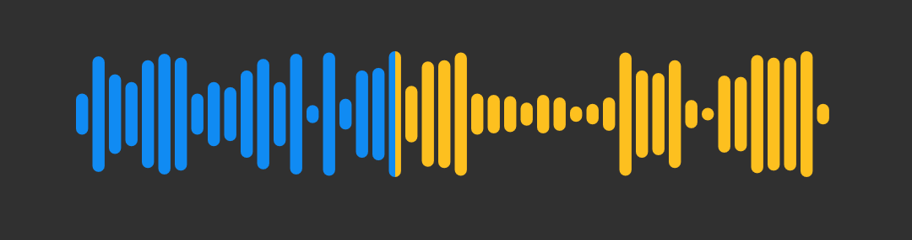
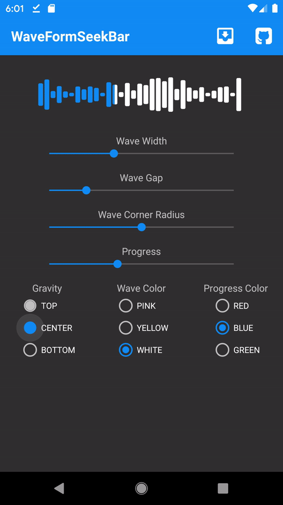

[](https://opensource.org/licenses/Apache-2.0)
# WaveformSeekBar
Android Waveform SeekBar library

This library works with api level 21 and higher





## How to add

Add below lines in your root build.gradle at the end of repositories

```
allprojects {
  repositories {
    ...
    maven { url 'https://jitpack.io' }
  }
}
```
Add the dependency to your app build.gradle file

```
dependencies {
    implementation  'com.github.massoudss:waveformSeekBar:2.0.0' // Or compile in older versions
}
```

And then sync your gradle.


## How to use
You can simply use this View like other Views in android,
just add ``WaveformSeekBar`` in your java/kotlin code or xml.
### XML
```
<com.masoudss.lib.WaveformSeekBar
        app:wave_progress="33"
        app:wave_width="5dp"
        app:wave_gap="2dp"
        app:wave_min_height="5dp"
        app:wave_corner_radius="2dp"
        app:wave_background_color="@color/colorAccent"
        app:wave_progress_color="@color/colorPrimary"
        app:wave_gravity="center"
        android:id="@+id/waveformSeekBar"
        android:layout_width="300dp"
        android:layout_height="50dp"/>
```

### Kotlin
```
val waveformSeekBar = WaveformSeekBar(yourContext)
waveformSeekBar.progress = 33
waveformSeekBar.waveWidth = Utils.dp(this,5)
waveformSeekBar.waveGap = Utils.dp(this,2)
waveformSeekBar.waveMinHeight = Utils.dp(this,5)
waveformSeekBar.waveCornerRadius = Utils.dp(this,2)
waveformSeekBar.waveGravity = WaveGravity.CENTER
waveformSeekBar.waveBackgroundColor = ContextCompat.getColor(this,R.color.colorAccent)
waveformSeekBar.waveProgressColor = ContextCompat.getColor(this,R.color.colorPrimary)
waveformSeekBar.sample = sample data Int array
waveformSeekBar.setSampleFrom(AUDIO_FILE || AUDIO_PATH)
```

### Java
```
WaveformSeekBar waveformSeekBar = new WaveformSeekBar(yourContext);
waveformSeekBar.setProgress(33);
waveformSeekBar.setWaveWidth(Utils.dp(this,5));
waveformSeekBar.setWaveGap(Utils.dp(this,2));
waveformSeekBar.setWaveMinHeight(Utils.dp(this,5));
waveformSeekBar.setWaveCornerRadius(Utils.dp(this,2));
waveformSeekBar.setWaveGravity(WaveGravity.CENTER);
waveformSeekBar.setWaveBackgroundColor(ContextCompat.getColor(this,R.color.white));
waveformSeekBar.setWaveProgressColor(ContextCompat.getColor(this,R.color.blue));
waveformSeekBar.setSample(sample data Int array);
waveformSeekBar.setSampleFrom(AUDIO_FILE || AUDIO_PATH);
```

### Progress Listener
```
waveformSeekBar.onProgressChanged = object : SeekBarOnProgressChanged {
            override fun onProgressChanged(waveformSeekBar: WaveformSeekBar, progress: Int, fromUser: Boolean) {
                // do your stuff here
            }
        }
```


## View Properties 

you can customize WaveformSeekBar, all of this attributes can change via xml or code (runtime)

|Attribute|Type|Kotlin|Description|
|:---:|:---:|:---:|:---:|
|wave_progress|Integer|`progress`|SeekBar progress value, default value is `0`|
|wave_width|Dimension|`waveWidth`|Width of each wave, default value is `5dp`|
|wave_gap|Dimension|`waveGap`|Gap width between waves, default value is `2dp`|
|wave_min_height|Dimension|`waveMinHeight`|Minimum height of each wave, default value is equal to `waveWidth`|
|wave_corner_radius|Dimension|`waveCornerRadius`|Corner raduis of each wave, default value is `2dp`|
|wave_gravity|Enum|`waveGravity`|Waves Gravity, default is `WaveGravity.CENTER`|
|wave_background_color|Color|`waveBackgroundColor`|UnReached Waves color, default color is `Color.LTGRAY`|
|wave_progress_color|Color|`waveProgressColor`|Reached Waves color, default color is `Color.WHITE`|
| - |IntArray|`sample`|Sample data for drawing waves, default is `null`|

# License
```
Licensed under the Apache License, Version 2.0 (the "License");
you may not use this file except in compliance with the License.
You may obtain a copy of the License at

    http://www.apache.org/licenses/LICENSE-2.0

Unless required by applicable law or agreed to in writing, software
distributed under the License is distributed on an "AS IS" BASIS,
WITHOUT WARRANTIES OR CONDITIONS OF ANY KIND, either express or implied.
See the License for the specific language governing permissions and
limitations under the License.
```
