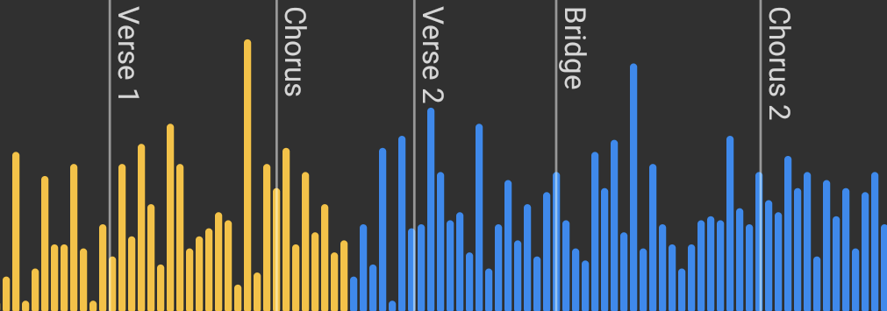

[](https://opensource.org/licenses/Apache-2.0)
# WaveformSeekBar
Android Waveform SeekBar library





## How to add

Add below lines in your root build.gradle at the end of repositories

``` groovy
allprojects {
  repositories {
    ...
    maven { url 'https://jitpack.io' }
  }
}
```
Add the dependency to your app build.gradle file

``` groovy
dependencies {
    implementation  'com.github.massoudss:waveformSeekBar:5.0.0'

    // Amplitude will allow you to call setSampleFrom() with files, URLs, Uri and resources
    // Important: Only works with api level 21 and higher
    implementation 'com.github.lincollincol:amplituda:2.1.0' // or newer version
}
```

And then sync your gradle.


## How to use
You can simply use this View like other Views in android,
just add ``WaveformSeekBar`` in your java/kotlin code or xml.
### XML
``` xml
<com.masoudss.lib.WaveformSeekBar
    app:wave_progress="33"
    app:wave_max_progress="100"
    app:wave_width="5dp"
    app:wave_gap="2dp"
    app:wave_min_height="5dp"
    app:wave_corner_radius="2dp"
    app:wave_background_color="@color/white"
    app:wave_progress_color="@color/blue"
    app:wave_gravity="center"
    app:wave_padding_top="2dp"
    app:wave_padding_Bottom="2dp"
    app:wave_padding_right="2dp"
    app:wave_padding_left="2dp"
    // setting wave_visible_progress will disable markers                            
    app:wave_visible_progress="50"
    app:marker_color="@color/red"
    app:marker_width="1dp"
    app:marker_text_color="@color/colorAccent"
    app:marker_text_padding="2dp"
    app:marker_text_size="12dp" />
```

### Set samples
``` kotlin
// Custom samples
waveformSeekBar.setSampleFrom(intArrayOf( /* samples */ ))

/* Functions below require Amplituda library dependency */
// Local audio file
waveformSeekBar.setSampleFrom(File("/storage/emulated/0/Music/song.mp3"))

// Path to local file
waveformSeekBar.setSampleFrom("/storage/emulated/0/Music/song.mp3")

// Url
waveformSeekBar.setSampleFrom("https://audio-url-example.com/song.mp3")

// Uri
waveformSeekBar.setSampleFrom("URI")

// Resource (res/raw)
waveformSeekBar.setSampleFrom(R.raw.song)
```

### Progress Listener
``` kotlin
waveformSeekBar.onProgressChanged = object : SeekBarOnProgressChanged {
    override fun onProgressChanged(waveformSeekBar: WaveformSeekBar, progress: Int, fromUser: Boolean) {
        // do your stuff here
    }
}
```

### Customization
#### Kotlin
``` kotlin
waveformSeekBar.apply {
    progress = 33.2F
    waveWidth = 5F
    waveGap = 2F
    waveMinHeight = 5F
    waveCornerRadius = 2F
    waveGravity = WaveGravity.CENTER
    wavePaddingTop = 2
    wavePaddingBottom = 2
    wavePaddingRight = 2
    wavePaddingLeft = 2
    waveBackgroundColor = Color.WHITE
    waveProgressColor = Color.BLUE
    markerTextColor = Color.MAGENTA
    markerTextPadding = 1F
    markerTextSize = 12F
    markerWidth = 1F
    markerColor = Color.RED
}
```

### View Properties

You can customize WaveformSeekBar, all of this attributes can change via xml or code (runtime)

|Attribute|Type|Kotlin|Description|
|:---:|:---:|:---:|:---:|
|wave_progress|Float|`progress`|SeekBar progress value, default value is `0F`|
|wave_max_progress|Float|`maxProgress`|SeekBar max progress value, default value is `100F`|
|wave_visible_progress|Float|`visibleProgress`|How much part of the progress should be shown, default value is `0F` meaning everything is shown and progress indicator moves, if value > `0F` the bars move and progress indicator stays in the center|
|wave_width|Dimension|`waveWidth`|Width of each wave, default value is `5dp`|
|wave_gap|Dimension|`waveGap`|Gap width between waves, default value is `2dp`|
|wave_padding_top|Dimension|`wavePaddingTop`|Waves padding width from top, default value is `0`|
|wave_padding_bottom|Dimension|`wavePaddingBottom`|Waves padding width from bottom, default value is `0`|
|wave_padding_right|Dimension|`wavePaddingRight`|Waves padding width from right, default value is `0`|
|wave_padding_left|Dimension|`wavePaddingLeft`|Waves padding width from left, default value is `0`|
|wave_min_height|Dimension|`waveMinHeight`|Minimum height of each wave, default value is equal to `waveWidth`|
|wave_corner_radius|Dimension|`waveCornerRadius`|Corner radius of each wave, default value is `2dp`|
|wave_gravity|Enum|`waveGravity`|Waves Gravity, default is `WaveGravity.CENTER`|
|wave_background_color|Color|`waveBackgroundColor`|Unreached Waves color, default color is `Color.LTGRAY`|
|wave_progress_color|Color|`waveProgressColor`|Reached Waves color, default color is `Color.WHITE`|
|marker_width|Dimension|`markerWidth`|Marker vertical line width, default value is `1dp`|
|marker_color|Color|`markerColor`|Marker vertical line color, default value is `Color.GREEN`|
|marker_text_size|Dimension|`markerTextSize`|Marker text size, default value is `12dp`|
|marker_text_color|Color|`markerTextColor`|Marker text color, default color is `Color.RED` |
|marker_text_padding|Dimension|`markerTextPadding`|Marker text padding, default value is `0`|
| - |IntArray|`sample`|Sample data for drawing waves, default is `null`|

### Reduce size
Add ``` android:extractNativeLibs="false" ``` to application in the Manifest.xml

``` xml
<application
      . . .
    android:extractNativeLibs="false"
      . . . >
    <activity . . ./>
</application>
```

## License
```
Licensed under the Apache License, Version 2.0 (the "License");
you may not use this file except in compliance with the License.
You may obtain a copy of the License at

    http://www.apache.org/licenses/LICENSE-2.0

Unless required by applicable law or agreed to in writing, software
distributed under the License is distributed on an "AS IS" BASIS,
WITHOUT WARRANTIES OR CONDITIONS OF ANY KIND, either express or implied.
See the License for the specific language governing permissions and
limitations under the License.
```
